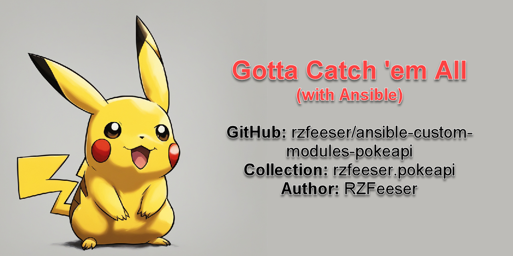

# rzfeeser.pokeapi - PokeAPI.co Ansible Collection
Author: Russell Zachary Feeser  
GitHub: @RZFeeser  
 Email: rzfeeser@users.noreply.github.com  

This repository is an ansible collection, `rzfeeser.pokeapi`, written by @RZFeeser for the purposes of an Ansible collection containing plugins and playbooks that abstract interaction with API v2 service @ [pokeapi.co](https://pokeapi.co/)

#### Resources
- [@GitHub - rzfeeser/ansible-custom-modules-pokeapi](https://github.com/rzfeeser/ansible-custom-modules-pokeapi)
- [@GitLab - PokeAPI Ansible Execution Environment](https://gitlab.com/rzfeeser/ansible-execution-environments)
- [pokeapi.co](https://pokeapi.co/)

#### Install Notes
- This Ansible collection is written with the Python standard library, so it has no dependenies beyond itself.
- This is an Ansible collection and may be installed using one of the following methods:
  1. Install directly from source on GitHub
  2. Proxied from ansible.galaxy.com
  3. Bypass a direct install, and instead use the PokeAPI Execution Environment container based solution (suitable for CI engines such as AAP, Tower, AWX, 56o0Jenkins, GitLab, and so on)

##### Option 01 - Install directly from source on Github
- Ansible should already be installed
- Install rzfeeser.pokeapi collection directly from GitHub - `ansible-galaxy collection install git+https://github.com/rzfeeser/ansible-custom-modules-pokeapi`

##### Option 02 - Proxied from ansible.galaxy.com
- Ansible should already be installed
- Install rzfeeser.pokeapi collection via ansible.galaxy.com - `ansible-galaxy collection install rzfeeser.pokeapi`

##### Option 03 - Container based solution
- `ansible-runner` needs to be installed, and Docker needs to exist
  - It should be mentioned that `ansible-runner` requires a special project directory layout before executing. See the [ansible-runner Project Homepage](https://ansible.readthedocs.io/projects/runner/en/stable/index.html) for more information
- An Ansible Execution Environment container is maintained by this author, [@RZFeeser on GitLab](https://gitlab.com/rzfeeser/ansible-execution-environments). This solution includes Ansible, Python, Ansible-Runner, and the most recent `rzfeeser.pokeapi` collection
- Use `ansible-runner` to run a playbook containing references to the `rzfeeser.pokeapi` collection - `ansible-runner run --process-isolation --process-isolation-executable docker --container-image registry.gitlab.com/rzfeeser/ansible-execution-environments/pokeapi-ee -p playbook_to_run.yml .`

##### About the Author
I'm an consultant and technology trainer focusing on Ansible, Python, AWX/Tower/AAP, Terraform, Go, Azure, 5G and core telecom communications. If you're interested in discussing a consulting or training project, feel free to reach out.
